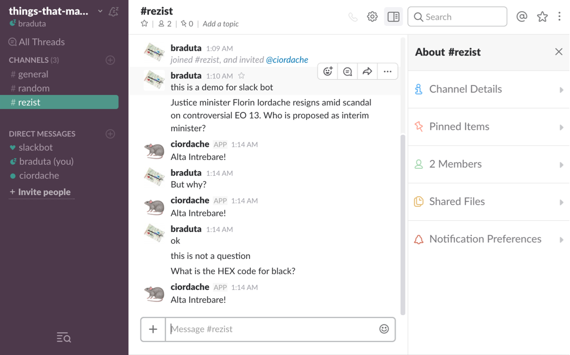

# ciordacheBot


The CiordacheBot is a Slack bot that smacks you with a straight answer for every question.





## Installation

As simple as installing any other global node package. Be sure to have npm and node (`>= 0.10` version, or io.js `>= 1.0`) installed and launch:

```bash
$ npm install -g ciordachebot
```


## Running the CiordacheBot

To run the CiordacheBot you must have an [API token](#getting-the-api-token-for-your-slack-channel) to authenticate the bot on your slack channel. Once you get it (instructions on the next paragraph) you just have to run:


```bash
BOT_API_KEY=somesecretkey ciordachebot
```


## Getting the API token for your Slack channel

To allow the CiordacheBot to connect your Slack channel you must provide him an API key. To retrieve it you need to add a new Bot in your Slack organization by visiting the following url: https://*yourorganization*.slack.com/services/new/bot, where *yourorganization* must be substituted with the name of your organization (e.g. https://*loige*.slack.com/services/new/bot). Ensure you are logged to your Slack organization in your browser and you have the admin rights to add a new bot.

You will find your API key under the field API Token, copy it in a safe place and get ready to use it.


## Configuration

The CiordacheBot is configurable through environment variables. There are two variable available:

| Environment variable | Description |
|----------------------|-------------|
| `BOT_API_KEY` | this variable is mandatory and must be used to specify the API token needed by the bot to connect to your Slack organization |
| `BOT_NAME` | the name of your bot, it’s optional and it will default to ciordache |


## Launching the bot from source

If you downloaded the source code of the bot you can run it using NPM with:

```bash
$ npm start
```

Don't forget to set your `BOT_API_KEY` environment variable before doing so. Alternatively you can also create a file called `token.js` in the root folder and put your token there (you can use the `token.js.sample` file as a reference).


## The Making of

The CiordacheBot was inspired by Romanian Justice minister Florin Iordache answer to journalists questions with [24 "Another Question!"](https://www.youtube.com/watch?v=VgV89pVQtow). Creation of this Bot was based on a [very detailed article](https://scotch.io/tutorials/building-a-slack-bot-with-node-js-and-chuck-norris-super-powers) published on [scotch.io](https://scotch.io).

Enjoy your reading!


## License

Licensed under [MIT License](LICENSE). © Luciano Mammino.
